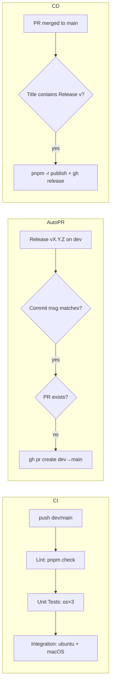

# Design: Adapt CI/CD Workflow

## Technical Approach

Two-axis change: (A) harden `.github/workflows/ci.yml` — add main-branch trigger, enforce job ordering (`lint → unit-tests → integration-tests`), expand integration-tests to macOS, use `pnpm check` in lint, cache wasmtime downloads. (B) add `.github/workflows/auto-pr.yml` for Release commits on `dev` → auto PR `dev→main`, then simplify `.github/workflows/release.yml` to trigger on that PR merge and publish directly — removing the changesets workflow entirely. Update AGENTS.md to match.

## Architecture Decisions

| Option               | Tradeoffs                                                                               | Decision                                                              |
| -------------------- | --------------------------------------------------------------------------------------- | --------------------------------------------------------------------- |
| CI job order         | Parallel is faster but allows tests on broken code. Sequential fails fast.              | `unit-tests` needs `lint`; `integration-tests` needs `unit-tests`     |
| integration-tests OS | macOS adds build time but catches platform bugs. Same matrix strategy as unit-tests.    | `matrix.os: [ubuntu-latest, macos-latest]` with conditional `apt-get` |
| Cache strategy       | `actions/cache` adds setup/save time (~5s) but saves ~30s on wasmtime download per run. | Cache `~/.wasm-linker/` keyed by `runner.os` + hash of linker config  |
| Release trigger      | PR `closed` event carries PR context (title). Push event has no PR title to match.      | `pull_request: types: [closed]` with title filter `Release v`         |
| Duplicate PR         | `gh pr list` check avoids API 422. Always-create is simpler but noisier.                | Pre-check via `gh pr list --base main --head dev`                     |
| Changesets removal   | Cleaner pipeline, but version responsibility shifts to author.                          | Remove all changesets steps; publish with `pnpm -r publish` directly  |

## Data Flow

## File Changes

| File                            | Action | Description                                                                                                                          |
| ------------------------------- | ------ | ------------------------------------------------------------------------------------------------------------------------------------ |
| `.github/workflows/ci.yml`      | Modify | Add `push: branches: [main]`, `unit-tests.needs: lint`, macOS matrix for integration, `pnpm check` step, cache for `~/.wasm-linker/` |
| `.github/workflows/auto-pr.yml` | Create | New workflow: push-to-dev trigger, commit message regex, `gh pr create`                                                              |
| `.github/workflows/release.yml` | Modify | Change trigger to PR merge with title filter, remove changesets steps, add `pnpm -r publish`                                         |
| `AGENTS.md`                     | Modify | Update CI section (main trigger, pnpm check), replace release section (auto PR flow, no changesets)                                  |

## Interfaces / Contracts

**auto-pr.yml contract**: receives `push` event on `dev`. Reads `github.event.head_commit.message`. Outputs: PR created or skipped. Permissions: `contents: read`, `pull-requests: write`.

**release.yml contract**: receives `pull_request` event with `types: [closed]`. Reads `github.event.pull_request.merged` and `github.event.pull_request.title`. Outputs: npm publish + GitHub Release. Permissions: `contents: write`, `id-token: write`, `pull-requests: write`.

Commit message regex for auto-PR: `/^Release v\d+\.\d+\.\d+$/`

## Testing Strategy

| Layer       | What to Test                     | Approach                                                                    |
| ----------- | -------------------------------- | --------------------------------------------------------------------------- |
| Integration | CI workflow acts as its own test | Manual — observe CI runs after merge                                        |
| E2E         | Auto PR + CD flow                | Push `Release v1.4.0-test` to dev, verify PR created, merge, verify publish |
| Manual      | AGENTS.md accuracy               | Post-merge review of docs                                                   |

## Threat Matrix

| Boundary                 | Applicability                                                                     | Design response                                                                                                                           | Planned RED tests |
| ------------------------ | --------------------------------------------------------------------------------- | ----------------------------------------------------------------------------------------------------------------------------------------- | ----------------- |
| Documentation-like paths | N/A — no executable MDX/README.sh                                                 | —                                                                                                                                         | —                 |
| Git repository selection | N/A — GitHub Actions uses `GITHUB_WORKSPACE` exclusively                          | —                                                                                                                                         | —                 |
| Commit state             | N/A — no staged/commit -a operations; `gh` handles git internals                  | —                                                                                                                                         | —                 |
| Push state               | N/A — no explicit push operations; `gh pr create` handles push                    | —                                                                                                                                         | —                 |
| PR commands              | **Applicable** — `gh pr create` in auto-pr.yml with `--base`, `--head`, `--title` | Token scoped to `pull-requests: write`; `--fill` not used — explicit args avoid injection via body; duplicate check runs before create; ` |                   | true` removed — workflow fails loudly on gh failure | `gh pr create` fails → workflow failure; duplicate PR → logged skip; commit without version → no PR; semver-invalid → no PR with warning |

## Migration / Rollout

No migration required. Merge to `dev`, verify CI passes, merge PR to `main`. Delete `.changeset/` directory after confirming no pending changesets.

## Open Questions

- [ ] Confirm wasmtime linker version pinning for cache key (current: no pinned version, downloads latest)
- [ ] Confirm macOS runners have cmake pre-installed or need `brew install cmake`
